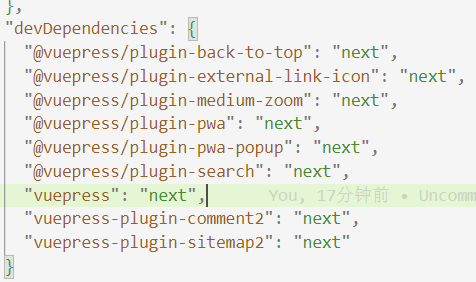
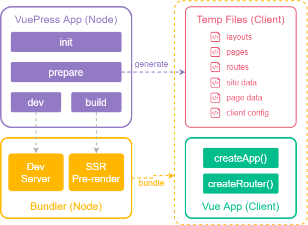
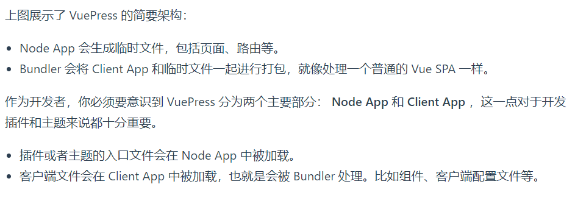
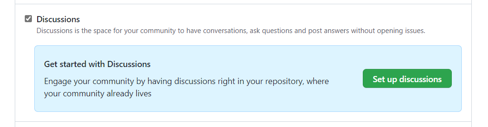
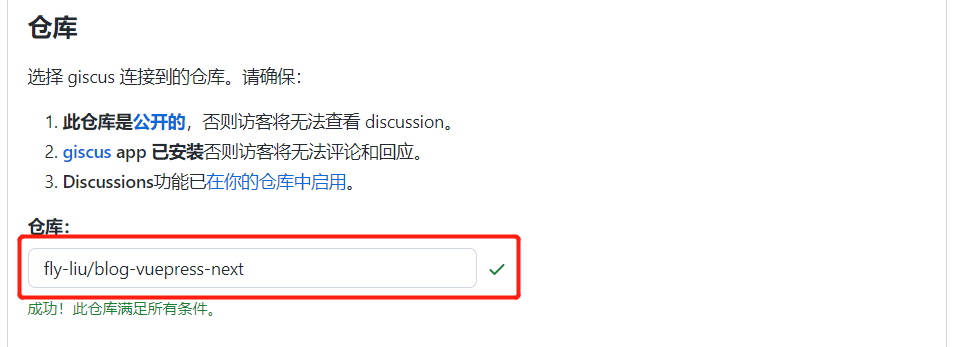
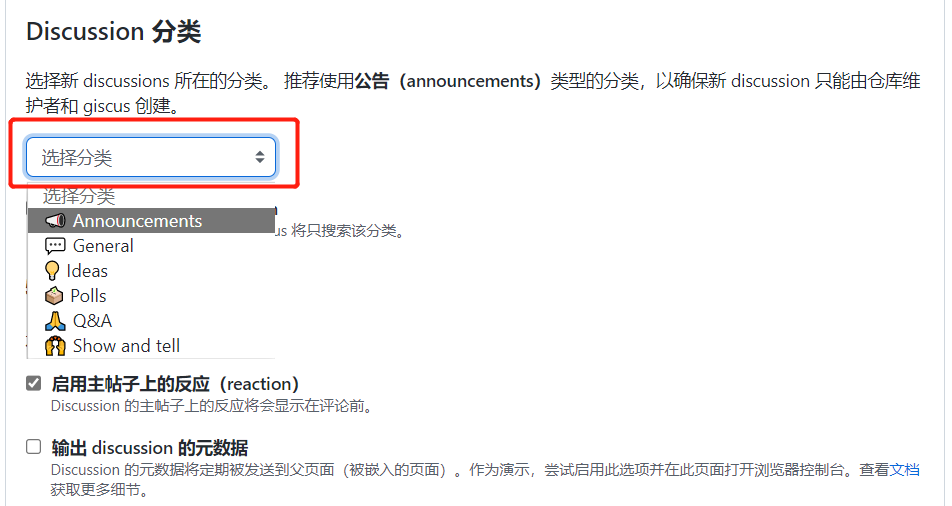
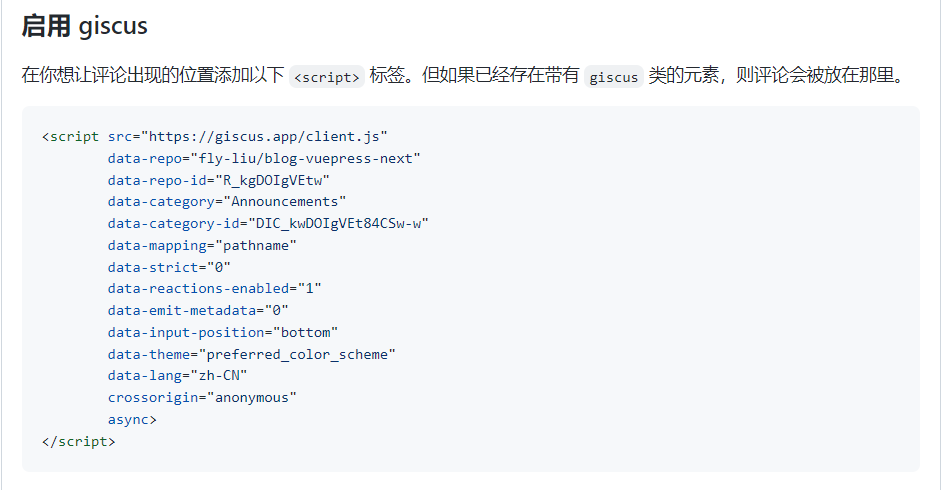
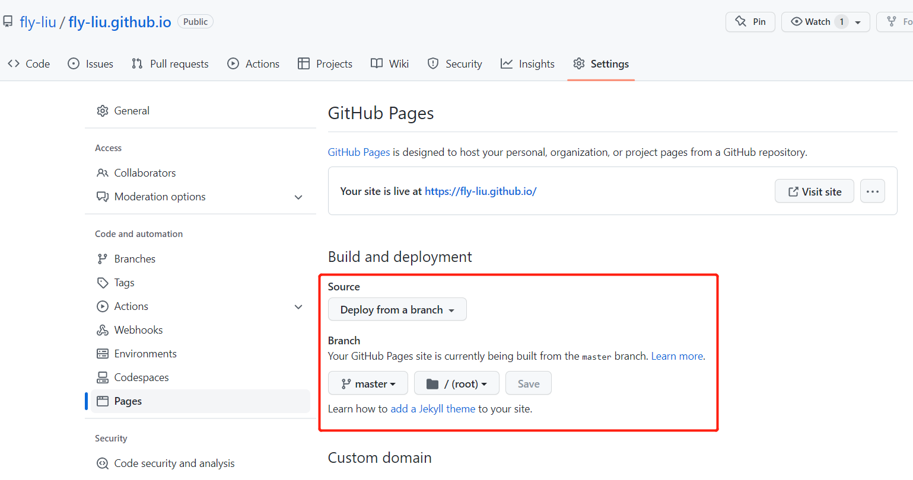

# 使用VuePress2.x构建博客网站
官方文档参考：[VuePress2.x 快速上手](https://v2.vuepress.vuejs.org/zh/guide/getting-started.html)

## 目标
- 构建项目并运行；
- 架构；
- 自定义首页；
- 自定义列表页面；
- 开发插件；
- 列表页实现；
- 集成官方插件和相关配置；
- 集成评论插件；
- 项目部署；

## 依赖环境
Node.js v14.18.0+

## 构建项目并运行

### 项目创建和初始化
打开`Git Bash Here`工具
```sh
# 创建并进入目录
mkdir vuepress-next-blog && cd vuepress-next-blog

# 初始化项目和git
npm init && git init

# 安装依赖
npm i -D vuepress@next
```

::: warning 提示
因为目前使用 beta 版本构建，安装依赖或项目启动/构建时可能有报错，建议始终安装最新版本依赖，出现报错时可以选择两种方式解决，

1. 将依赖包全部重新安装一次，后面都加上`@next`
比如：`npm install -D vuepress@next @vuepress/plugin-back-to-top@next ...`

2. 或者将`package.json`中`devDependencies`依赖版本都改为`next`，这样就不用手动指定依赖包版本了，然后执行`npm i`


:::

在`package.json`中添加一些`scripts`
```json
{
  // ...
  "scripts": {
    "docs:dev": "vuepress dev docs",
    "docs:build": "vuepress build docs"
  }
  // ...
}
```

将默认的临时目录和缓存目录添加到添加到 .gitignore 中
```sh
echo 'node_modules' >> .gitignore
echo '.temp' >> .gitignore
echo '.cache' >> .gitignore
```

添加文章
```sh
mkdir docs && echo '# Hello VuePress' > docs/index.md
```

### 项目启动
```sh
npm run docs:dev
```

## 架构
 
 
上面引用官方的描述，可以知道开发插件要在 Node App 中进行，自定义页面布局要在 Client App 引入注册。

### 目录结构
先看下目录结构，配置和页面布局文件都在`.vuepress`目录下面，布局在 layouts 中，这里可以写我们的 vue 代码。

```text
├─ docs
│  ├─ .vuepress
│  │  ├─ layouts     <--- 布局
│  │  ├─ plugins     <--- 插件
│  │  ├─ public      <--- 静态资源
│  │  ├─ styles      <--- 样式文件
│  │  ├─ client.js   <--- 客户端配置文件
│  │  └─ config.js   <--- 配置文件
│  ├─ about.md       <--- 关于 
│  ├─ index.md       <--- 首页
│  ├─ list.md        <--- 列表
│  └─ tags.md        <--- 标签页
├─ .gitignore
└─ package.json
```

### 配置
如果只使用基础功能的话，参考官方[配置](https://v2.vuepress.vuejs.org/zh/reference/config.html)就行。

下面为`.vuepress/config.ts`完整配置，根据[官方插件参考](https://v2.vuepress.vuejs.org/zh/reference/plugin/back-to-top.html)集成了插件返回顶部、PWA、图片缩放、内容搜索等功能，安装方式参考官方文档，比较简单。

```ts
import { defaultTheme } from '@vuepress/theme-default'
import { pwaPlugin } from '@vuepress/plugin-pwa'
import { pwaPopupPlugin } from '@vuepress/plugin-pwa-popup'
import { backToTopPlugin } from '@vuepress/plugin-back-to-top'
import { externalLinkIconPlugin } from '@vuepress/plugin-external-link-icon'
import { searchPlugin } from '@vuepress/plugin-search'
import { mediumZoomPlugin } from '@vuepress/plugin-medium-zoom'
import { commentPlugin } from 'vuepress-plugin-comment2'
import pagePlugin from './plugins/page'

export default {
  base: '/', // 站点的基础路径
  title: '刘哈哈的个人笔记',
  description: '记录 笔记 博客 git', // 网站描述
  // 被注入页面 HTML <head> 额外的标签
  head: [
    ['link', { rel: 'manifest', href: '/manifest.json' }],
    ['link', { rel: 'icon', href: `/imgs/zAo2nK.png` }],
    ['meta', { name: 'google', value: 'notranslate' }],
    ['meta', { name: 'theme-color', content: '#3eaf7c' }],
    ['meta', { name: 'apple-mobile-web-app-capable', content: 'yes' }],
    ['meta', { name: 'apple-mobile-web-app-status-bar-style', content: 'black' }],
    ['link', { rel: 'apple-touch-icon', href: `/imgs/zAo2nK.png` }],
    ['link', { rel: 'mask-icon', href: '/imgs/zAo2nK.png', color: '#3eaf7c' }],
    ['meta', { name: 'msapplication-TileImage', content: '/imgs/zAo2nK.png' }],
    ['meta', { name: 'msapplication-TileColor', content: '#000000' }],
    ['meta', { name: 'referrer', content: 'same-origin' }],
    ['meta', { name: 'referrer', content: 'no-referrer' }],
  ],
  host: '0.0.0.0',
  dest: '.vuepress/dist', // 指定 vuepress build 命令的输出目录
  locales: {
    // 键名是该语言所属的子路径
    // 作为特例，默认语言可以使用 '/' 作为其路径。
    '/': {
      lang: 'zh-CN', // 将会被设置为 <html> 的 lang 属性
      title: '刘哈哈的个人笔记',
      description: 'Vue-Press blog 博客 记录 笔记 git',
    }
  },
  theme: defaultTheme({
    repo: 'https://github.com/fly-liu/blog-vuepress-next', // github链接
    logo: '/imgs/zAo2nK.png', // 博客的 logo
    // 导航菜单
    navbar: [
      { text: '文章', link: '/list/' },
      { text: '后端', link: '/serve/' },
      { text: '关于我', link: '/about/' }
    ],
    sidebar: {
      '/serve/': [
        {
          text: '后端技术',
          link: '/serve/',
          collapsible: true,
          children: [
            '/serve/nodejs基础',
            '/serve/nodejs知识点',
            '/serve/express应用',
          ]
        },
      ]
    },
    editLink: false, // 是否启用 编辑此页 链接
    lastUpdatedText: '最后更新', // 最近更新时间戳 标签的文字
    contributorsText: '贡献者', // 贡献者列表 标签的文字
  }),
  markdown: {
    code: {
      // 是否在每个代码块的左侧显示行号
      lineNumbers: 5,
    }
  },
  plugins: [
    // 自定义组件
    pagePlugin,

    // 返回顶部插件
    backToTopPlugin(),

    // 外部链接图标插件
    externalLinkIconPlugin({
      locales: {
        '/': {
          openInNewWindow: 'open in new window',
        },
        '/zh/': {
          openInNewWindow: '在新窗口打开',
        },
      },
    }),

    // 本地搜索
    searchPlugin({
      locales: {
        '/': {
          placeholder: 'Search',
        },
        '/zh/': {
          placeholder: '搜索',
        },
      },
      hotKeys: [
        {
          'key': 'k',
          'ctrl': true,
        }
      ],
      maxSuggestions: 10, // 搜索结果的最大条数
    }),

    // PWA 插件
    pwaPlugin({
      skipWaiting: true,
    }),
    pwaPopupPlugin({
      locales: {
        '/': {
          message: 'New content is available.',
          buttonText: 'Refresh',
        },
        '/zh/': {
          message: '新的风暴已经出现',
          buttonText: '盘他',
        },
      },
    }),
    
    // 图片缩放
    mediumZoomPlugin(),

    // 评论插件
    commentPlugin({
      provider: 'Giscus',
      repo: 'fly-liu/blog-vuepress-next',
      repoId: 'R_kgDOIgVEtw',
      category: 'Announcements',
      categoryId: 'DIC_kwDOIgVEt84CSw-w',
    }),
  ],
}
```

## 自定义首页
VuePress 是以 Markdown 为中心的。项目中的每一个 Markdown 文件都是一个单独的页面。

默认配置下, `README.md`或`index.md`在打包时都会打包成`index.html`, 但是只能保留一个，否则会有冲突；

1. 在 Frontmatter 中指定自定义组件名
首页对应的 md 文件为`.vuepress/index.md`文件，在 md 文件顶部可以配置 YAML 格式的 Frontmatter，在 Frontmatter 中可以指定`layout`字段，用来指定自定义页面布局名称，默认查找`.vuepress/layouts`目录。
``` md
---
sidebar: false
layout: FristLayout
---
```

2. 在 .vuepress/client.ts 配置文件中引入自定义组件
在客户端配置文件`.vuepress/client.ts`中，注册布局组件
```js
import { defineClientConfig } from '@vuepress/client'

import FristLayout from './layouts/FristLayout.vue'

export default defineClientConfig({
  layouts: {
    FristLayout,
  },
})
```

这时在`FristLayout.vue`中就可以自定义首页内容了。


## 自定义列表页面
1. 在导航栏添加文章列表页入口，配置页面路由

参考默认主题[配置](https://v2.vuepress.vuejs.org/zh/reference/default-theme/config.html)路由
```ts
import { defineUserConfig } from 'vuepress'
import { defaultTheme } from '@vuepress/theme-default'

export default {
  theme: defaultTheme({
    // 导航菜单
    navbar: [
      { text: '文章', link: '/list/' },
    ]
  }),
}
```

2. 引入列表组件
和自定义首页类似，在对应的 md 文件配置中指定布局文件，然后在`.vuepress/client.ts`中注册一下布局组件
```js
import { defineClientConfig } from '@vuepress/client'

import Layout from './layouts/Layout.vue'
import FristLayout from './layouts/FristLayout.vue'
import ListLayout from './layouts/ListLayout.vue'
import AboutLayout from './layouts/AboutLayout.vue'

export default defineClientConfig({
  layouts: {
    Layout,  // 扩展默认布局文件
    FristLayout,
    ListLayout,
    AboutLayout,
  },
})
```
关键是要拿到文章的数据内容，可以通过开发插件的方式实现

## 开发插件
插件在 Node App 中开发，最后在 Client App 中使用，

- 创建插件文件`.vuepress/plugins/page.ts`

使用插件 API 扩展页面对象，计算文章大概读完时间，统计文章字数，通过正则匹配需要的页面对象，把页面列表绑定到列表页对象，最后根据 md 文件中`Frontmatter`中的`date`日期排序

```js
import { Ilist } from '../index'

const counter = function (content) {
  const cn = (content.match(/[\u4E00-\u9FA5]/g) || []).length;
  const en = (content.replace(/[\u4E00-\u9FA5]/g, '').match(/[a-zA-Z0-9_\u0392-\u03c9\u0400-\u04FF]+|[\u4E00-\u9FFF\u3400-\u4dbf\uf900-\ufaff\u3040-\u309f\uac00-\ud7af\u0400-\u04FF]+|[\u00E4\u00C4\u00E5\u00C5\u00F6\u00D6]+|\w+/g) || []).length;
  return [cn, en];
};

// 文章大概需要多久读完
const min2read = (content, minusLen = 0,{ cn = 250, en = 200 } = {}) => {
  const len = counter(content);
  const readingTime = len[0] / cn + len[1] / en;
  return readingTime < 1 ? '1m' : parseInt(`${readingTime}`, 10) + 'm';
}

// 文章的字数
const wordcount = (content, minusLen = 0) => {
  const len = counter(content);
  const count = len[0] + len[1];
  if (count < 1000) {
    return count;
  }
  return Math.round(count / 100) / 10 + 'k';
}

export default  {
  name: 'vuepress-plugin-page',
  
  // 页面扩展
  extendsPage(page) {
    // 去掉页面的Frontmatter
    const content = page.content.replace(/^(---\n[\s\S]*---)/, '')
    const time = min2read(content)
    const count = wordcount(content)
    page.time = time
    page.count = count
  },

  // 生命周期 Hooks
  onInitialized(app) {
    const lists: Ilist[] = []
    app.pages.forEach((item: any) => {
      // console.log(item.path,/^\/[\s\S]*\/[\s\S]*/.test(item.path) && item.path.indexOf('/serve') === -1);
      
      // 排除不需要的页面
      if(/^\/[\s\S]*\/[\s\S]*/.test(item.path)) {
        lists.push({
          path: item.data.path,
          title: item.data.title,
          frontmatter: item.data?.frontmatter,
          git: item.data?.git,
          time: item.time,
          count: item.count
        })
      }
      
      if(item.path === '/list.html') {
        item.data = {
          ...item.data,
          lists
        }
      }
    });

    // 排序
    lists.sort((s1, s2) => {
      const x = s1.frontmatter.date as string;
      const y = s2.frontmatter.date as string;
      return x > y ? -1 : x < y ? 1 : 0;
    })
  }
}
```

## 列表页实现
作为文章内容的入口，在客户端 API 中，获取插件扩展的页面对象，显示创建日期、字数、大概阅读时间等数据；

```vue
<script setup lang="ts">
import { ref, computed } from 'vue'
import { useRouter, useRoute } from "vue-router";
import { usePageData } from '@vuepress/client'
import { filterPageList } from './utils/utils.js'

import Navbar from "@vuepress/theme-default/lib/client/components/Navbar.vue";
import Tags from "./components/Tags.vue";

const query = useRoute().query
const curTag = ref(query?.tag || '')
const router = useRouter();
const page: any = usePageData()
const allList: any = filterPageList(page.value.lists, ['/serve/']) || []

const lists = computed(() => {
  return curTag.value ? allList.filter((item) => {
      return item.frontmatter?.tag?.includes(curTag.value)
    }) : allList
})

const handleChangeTag = (tag) =>{
  curTag.value = tag
}
</script>

<template>
  <Navbar />
  <div class="press-list common-box">
    <Tags :allList="allList" @changeTag="handleChangeTag"/>
    <div class="item-warrper">
      <div class="item-data" v-for="item in lists" :key="item.path">
        <div v-if="item.frontmatter.description" class="art">
          {{item.frontmatter.description}}……<a :href="item.path" class="look">阅读原文</a>
        </div>
        <div class="item-title-warpper">
          <h2 v-text="item.title" @click="router.push({ path: item.path })"></h2>
          <p @click="router.push({ path: item.path })">阅读全文 >></p>
        </div>

        <div class="more-box" v-if="item.excerpt" v-html="item.excerpt"></div>

        <div class="sign-box" :class="item.excerpt ? 'excerpt' : ''">
          <div class="item-time"><span class="time-icon"></span>{{item.frontmatter.date ? item.frontmatter.date : '- - -'}}</div>
          <div class="item-time">文章大概的字数:{{item.count}}</div>
          <div class="item-time">大概需要阅读的时间:{{item.time}}</div>
          <div class="item-tag-box" v-if="item.frontmatter.tag">
            <div 
              class="item-tag" 
              v-for="tagString in item.frontmatter.tag" 
              :key="tagString">
              <span class="tag-icon"></span>
              <span class="tag-text">{{tagString}}</span>
            </div>
          </div>
        </div>
      </div>
    </div>
  </div>
</template>
```

### 文章标签
自定义了一个文章标签组件，查询出所有页面的`frontmatter.tag`参数，并统计标签出现的次数，随机生成颜色，标签支持点击筛选功能

```vue
<script setup lang="ts">
import { getTagCount } from '../utils/utils.js'

const props = defineProps({
  allList: {
    type: Array,
    default() {
      return []
    }
  }
})

const emit = defineEmits(['changeTag'])

const allTags: any = props.allList.reduce((previous: any, current: any) => {
  return previous.concat(current.frontmatter.tag)
}, [])

const tagList: any = getTagCount(allTags)

</script>

<template>
  <section class="el-box">
    <div class="tag-box clearfix">
      <div class="item-tag fl" style="background-color: #46bd87;" @click="emit('changeTag', '')">全部</div>
      <div class="item-tag fl" 
        v-for="(tagObj,index) in tagList" 
        :key="index" 
        :style="'background-color:'+tagObj.color" 
        @click="emit('changeTag', tagObj.tagName)"
      >{{`${tagObj.tagName}&nbsp;&nbsp;(${tagObj.count})`}}</div>
    </div>
  </section>
</template>
```

### 文章页面默认布局扩展
如果需要扩展默认布局，可进入`.vuepress/layouts/Layout.vue`中自定义

## 集成官方插件和相关配置
完整代码可查看`.vuepress/config.ts`文件。

```ts
import { pwaPlugin } from '@vuepress/plugin-pwa'
import { pwaPopupPlugin } from '@vuepress/plugin-pwa-popup'
import { backToTopPlugin } from '@vuepress/plugin-back-to-top'
import { externalLinkIconPlugin } from '@vuepress/plugin-external-link-icon'
import { searchPlugin } from '@vuepress/plugin-search'
import { mediumZoomPlugin } from '@vuepress/plugin-medium-zoom'
import pagePlugin from './plugins/page'

export default {
  // ...
  plugins: [
    // 自定义组件
    pagePlugin,

    // 返回顶部插件
    backToTopPlugin(),

    // 外部链接图标插件
    externalLinkIconPlugin({
      locales: {
        '/': {
          openInNewWindow: 'open in new window',
        },
        '/zh/': {
          openInNewWindow: '在新窗口打开',
        },
      },
    }),

    // 本地搜索
    searchPlugin({
      locales: {
        '/': {
          placeholder: 'Search',
        },
        '/zh/': {
          placeholder: '搜索',
        },
      },
      hotKeys: [
        {
          'key': 'k',
          'ctrl': true,
        }
      ],
      maxSuggestions: 10, // 搜索结果的最大条数
    }),

    // PWA 插件
    pwaPlugin({
      skipWaiting: true,
    }),
    pwaPopupPlugin({
      locales: {
        '/': {
          message: '新的风暴已经出现',
          buttonText: '盘他',
        },
        '/en/': {
          message: 'New content is available.',
          buttonText: 'Refresh',
        },
      },
    }),
    
    // 图片缩放
    mediumZoomPlugin(),
  ],
}
```


## 集成评论插件
评论使用 Giscus 系统, Giscus 是 github 的一个功能，借助 github 在自己的网站上显示和添加评论。

我是在 vuepress 项目开通 Giscus。

找到 git 项目位置`Settings > General > Features > Discussions`, 勾选 Discussions


然后配置 [Giscus](https://giscus.app/zh-CN)， 输入一个公开的 git 仓库，选择 Discussion 分类



启用 giscus ，会自动生成的配置信息，将配置信息复制到插件配置中。


在项目中还得安装评论插件依赖包
```sh
npm i vuepress-plugin-comment2@next -D
```

`.vuepress/config.ts`配置可参考上面完整配置
```ts
import { commentPlugin } from 'vuepress-plugin-comment2'

export default {
  // ...
  plugins: [
    // 评论插件
    commentPlugin({
      provider: 'Giscus',
      repo: 'fly-liu/blog-vuepress-next',
      repoId: 'R_kgDOIgVEtw',
      category: 'Announcements',
      categoryId: 'DIC_kwDOIgVEt84CSw-w',
    })
  ]
  // ...
}
```

### 引入评论插件
这个插件还需要再默认布局文件中注册评论组件。

在`.vuepress/client.ts`中注册一下布局组件，

找到`.vuepress/layouts/Layout.vue`

将评论组件放在内容下方插槽，
```vue
<script setup lang="ts">
import ParentLayout from "@vuepress/theme-default/lib/client/layouts/Layout.vue";
import { onBeforeUnmount, onMounted, ref } from "vue";

const isDarkMode = ref(false);
let observer;

onMounted(() => {
  const html = document.querySelector("html") as HTMLElement;
  isDarkMode.value = html.classList.contains("dark");
  // watch theme change
  observer = new MutationObserver(() => {
    isDarkMode.value = html.classList.contains("dark");
  });
  observer.observe(html, {
    attributeFilter: ["class"],
    attributes: true,
  });
});

onBeforeUnmount(() => {
  observer.disconnect();
});
</script>

<template>
  <ParentLayout>
    <template #page-content-bottom>
      <CommentService :darkmode="isDarkMode" />
    </template>
  </ParentLayout>
</template>
```

## 项目部署
项目部署利用 GitHub Pages，部署之前在 GitHub 中得有一个域名访问项目，比如：`fly-liu.github.io`，然后配置`Settings > Pages`,


项目源码和打包后访问的项目是独立两个项目，参考别人的文章，写了一个`sh`脚本文件，

脚本中执行 vuepress 打包命令，然后进入打包后的文件中，将代码推送到`fly-liu.github.io`仓库中
```sh
#!/usr/bin/env sh

# 确保脚本抛出遇到的错误
set -e

# 生成静态文件
npm run docs:build

# 进入生成的文件夹
cd .vuepress/dist

git init -b main
git add .
git commit -m 'deploy blog'
# git push -f https://github.com/fly-liu/blog-vuepress-next.git main
git push -f https://github.com/fly-liu/fly-liu.github.io.git master
cd -
```

`package.json`中,`scripts`增加一个指令，
```json
{
  "scripts": {
    "deploy": "bash deploy.sh"
  }
}
```
windows 系统使用`Git Bash Here`工具执行脚本，否则可能报错。

参考：  
[VuePress2.x 快速上手](https://v2.vuepress.vuejs.org/zh/guide/getting-started.html)  
[基于vuepress2搭建专属自己的博客，并集成各种常用功能](https://slbyml.github.io/saves/blog.html)  
[博客搭建](https://github.com/mqyqingfeng/Blog)  
[vuepress2.x集成评论插件](https://www.cnblogs.com/dingshaohua/p/16382542.html)  

