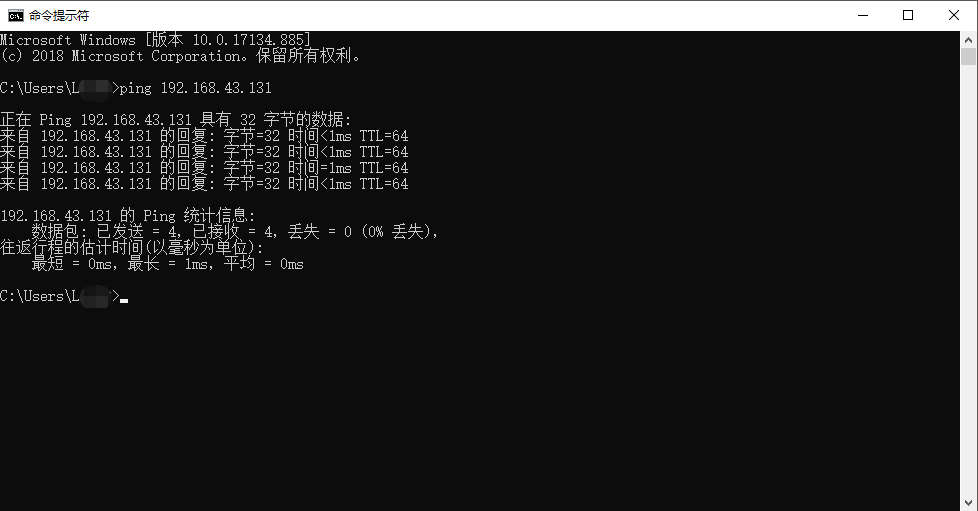
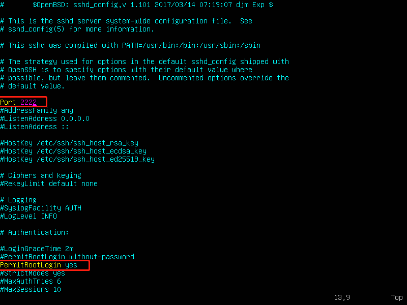
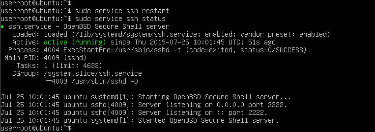
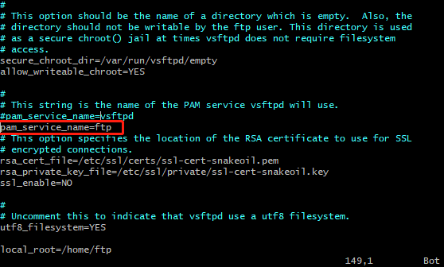
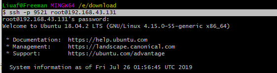

## 题记
在安装完虚拟机之后，可能你想要在通过本地shell软件或`git bash` 连接服务器的ssh服务，这一篇介绍在本地使用`git bash`通过ssh协议连接服务器。

概述：  
1. 首先安装SSH服务
2. 开启ROOT账户
3. 远程连接

首先确定一下本地能否ping到服务器，保证虚拟机能够和宿主机正常通信：
 

<!-- ---------------------------------------- SSH 相关开始 ------------------------------------------------------ -->
### 安装SSH服务
1. 查看SSH服务是否开启
使用`ps -e|grep ssh` 或 `sudo service ssh status` 查看,看sshd有没有进程就可以了，有的话说明SSH服务已安装，没有的话就需要安装了

这是已安装的状态，安装过后可跳过2、3步骤，  
 

2. 安装SSH服务
使用`sudo apt install ssh -y`  
或`sudo apt-get install openssh-server`
`sudo apt-get install openssh-client`  

`openssh-server`是服务端，通过开放本机的ssh服务，客户端才能连接，必选    
`open-client`是SSH客户端，通过open-client可以远程连接其他主机，可选

3. 启动SSH服务
`service ssh start` 或 `sudo /etc/init.d/ssh start`，然后查看SSH服务状态，使用步骤1的命令：`ps -aux |grep ssh`

4. 修改配置文件，设置完后重启服务
修改配置文件中的端口号和设置root用户的登录权限,输入命令：  
`sudo vim /etc/ssh/sshd_config`



注释掉`PermitRootLogin without-password`,重新`PermitRootLogin`参数的值为`yes`，PermitRootLogin可以限定root用户通过ssh的登录方式，如禁止登陆、禁止密码登录、仅允许密钥登陆和开放登陆  
设置为`yes`的意思是允许SSH登录，不限制登录方式

5. 重启SSH服务
`sudo service ssh restart` 或 `sudo /etc/init.d/ssh restart`,不报错表示重启成功，也可查询状态



`sudo /etc/init.d/ssh restart`

<!-- ---------------------------------------- SSH 相关结束 ------------------------------------------------------ -->
<!-- ---------------------------------------- FTP 相关开始 ------------------------------------------------------ -->

## FTP服务安装
- 安装vsftpd服务
```
sudo apt install vsftpd
```

- 配置 vsftpd 服务器
1. 备份配置文件
```
sudo mv /etc/vsftpd.conf /etc/vsftpd.conf_bak
```

2. 修改文件配置
```
sudo vim /etc/vsftpd.conf
```

修改内容如下：
```
listen=NO                                 #阻止 vsftpd 在独立模式下运行
anonymous_enable=NO                       #是否允许匿名登录，不做匿名的话就不重要
local_enable=YES                          #允许本地用户登陆
write_enable=YES                          #开启用户写权限（上传文件权限）
chroot_local_user=YES                     #限制用户只能看见 local_root 目录（或 home 目录）
chroot_list_enable=YES                    #启用限制用户名单                
chroot_list_file=/etc/vsftpd.chroot_list  #限制ftp登录的用户名单
local_root=/home/ftp　                     #设置根目录所在的位置，可以自己设置
pam_service_name=vsftpd
```

3. 创建ftp用户并设置密码
```
# 创建用户
# -m 自动建立/home/下的用户目录
sudo useradd -m <username>

# 修改密码
sudo passwd <username>

# 创建 FTP 根目录
# sudo mkdir /home/ftp/ftp_root
```

4. 添加访问ftp服务器的白名单
```
sudo vim /etc/vsftpd.chroot_list
```


这里面添加的用户，可以访问ftp服务器根目录之外的目录。

<!-- 修改 `/etc/pam.d/vsftpd`
```
sudo vim /etc/pam.d/vsftpd
```

注释掉`auth   required        pam_shells.so`, 保存退出 -->

5. 重启ftp服务
```
sudo service vsftpd restart
```

### FTP 其他命令
- 启动 ftp 服务
```
service vsftpd start
```

- 重启服务以及关闭服务
```
service vsftpd restart      #重启FTP服务
service vsftpd stop         #关闭FTP服务
```

- 查询状态
```
service vsftpd status 
或
ps -e | grep vsftpd
```

### 遇到的问题
- ftp登录错误
当我ftp账户连接FTP服务时（使用FileZilla），响应报错：


找了好久解决方法，问题出现在配置文件中


将`pam_service_name`值改为`ftp`

放上我找到的问题汇总，[ftp vsftpd 530 login incorrect 解决办法汇总](https://blog.csdn.net/wlchn/article/details/50855447)


- vim编辑文件时未正确退出解决方法
vim编辑文件时异常退出，下次使用vim编辑时会提示`swap file ".vsftpd.conf.swp"already exists！` ，并提示选择操作

使用vim编辑时实际上是先copy一份临时文件并映射到内存中让我们编辑，，当执行 w 后才保存临时文件到原文件，执行 q 会删除临时文件；每次启动vim都是检查是否存在临时文件，有就会询问如何处理，

解决办法是删除临时文件
`rm -f .vsftpd.conf.swp`

<!-- ---------------------------------------- FTP 相关结束 ------------------------------------------------------ -->

## root账户配置
1. 设置root角色的密码，若之前从来没有设置过，该操作也开启了root角色
`sudo passwd root`

### 使用git bash 远程连接
1. 打开`git bash`工具
2. 输入命令 `ssh root@192.168.43.131`

这里记录一下，刚开始在服务端安装完SSH服务后，使用`git bash`连接不上服务器，后来才查到是没有设置root账户，"root"是已创建的账户；如果改变端口后要跟 -p 加端口号，如：  
`$ ssh -p 9521 root@192.168.43.131`



退出服务使用命令：`logout`

